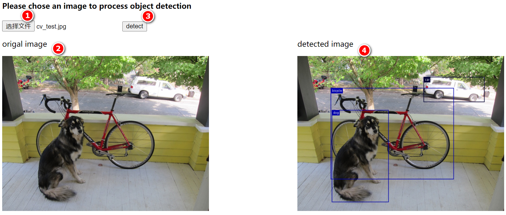

## 项目概述

### 功能点

用户在前端上传待检测的图片，点击按钮触发检测。后端对前端传入的图片完成目标检测算法的推理，返回带检测bounding box的图片给前端。前端展示原图和检测后的结果图。

### 效果图



### 技术点

前端使用html+js+jquery，后端使用SpringBoot+深度学习库DJL，不涉及数据库。

前端技术我连入门都不算，因此在前后端如何传递图片数据上花了不少时间，这里重点记录下。

#### 前端上传和传图片给后端

用input标签让用户上传本地图片。

```html
<input id="browse_file" type="file" accept="image/*"/>
```

以FormData形式封装图片数据以传给后端服务。

```js
var file=$('#browse_file')[0].files[0];
var formData=new FormData();    
formData.append('file', file);  //属性名称必须和后端接口@RequestParam标记的参数名一致
console.log("formData:", formData.get('file'));
$.ajax({
    url : "http://localhost:8080/detectshow/formdata",  
    type : 'POST',  
    data : formData,  
    processData : false,  //必须false才会避开jQuery对 formdata 的默认处理   
    contentType : false,  //必须false才会自动加上正确的Content-Type
    success : function(result) {  //jquery请求返回的结果好像都是字符串类型
        console.log("reponse result:", result);
    },  
    error : function(result) {  
        console.log("reponse result:", result);
        alert("Post Faile!");
    }
}); 
```

后端接口用MultipartFile接收前端传递的FormData数据。`@RequestParam("file")`注解定义的参数名必须和前端封装FormData的属性名`formData.append('file', file)`保持一致，否则前端调用后端服务时会报错：`Resolved [org.springframework.web.multipart.support.MissingServletRequestPartException: Required request part 'file' is not present]
cross_road`。

```java
@ResponseBody
@RequestMapping(value="/detectshow/formdata", method = RequestMethod.POST)
public String detectShowImageOfFormData(@RequestParam("file") MultipartFile file) throws ModelException, TranslateException, IOException {
    return cvService.objectDetectShowFormData(file);
}
```

#### 后端传图片给前端展示

在网上搜了一圈，知道至少有三种方式：

- 后端把图片保存在文件存储服务器上，返回图片的url给前端，前端设置img标签的src=url即可。这种方式应该是主流，但是不想再搞个存储服务器，没有采用这种方式。
- 后端以把图片的二进制数据以字节数组的形式返给前端，前端再解析为图片展示。但是jquery拿到的后端传过来的byte[]确实字符数组，还需要先把字符数组转给字节数组，然后再解析为图片，不如base64编码来得快。
- 后端以把图片的base64编码以字符串的形式返给前端，前端再解析为图片展示。这种方式虽然存在大图片有可能被截断的肯，但是来得方便，选用了这种方式。

```js
$.ajax({
    url : "http://localhost:8080/detectshow/formdata",  
    type : 'POST',  
    data : formData,  
    processData : false,    
    contentType : false, 
    success : function(result) {  //jquery请求返回的结果好像都是字符串类型
        console.log("reponse result:", result);
        var src = 'data:image/png;base64,' + result;  //直接把base64编码作为img标签的src属性值
        $("#detected_img").attr('src', src);
        $("#detected_img").css("width", "70%");
        $("#detected_img").css("height", "70%");
    },  
    error : function(result) {  
        console.log("reponse result:", result);
        alert("Post Faile!");
    }
}); 
```

#### Deep Java Library

可以参考前一篇博客。

## 项目搭建

### 开发环境

Win10 + JDK 8 + SpringBoot 2.4.1 + jquery 1.10.2 + DJL 0.9.0

### 项目结构

前端比较简单，只是1个简单的html文件，用于上传本地图片并传给后台处理，接受后台返回的检测结果并展示。

后端以SpringBoot搭建Web应用，提供1个服务接口，接受前端传递的图片，检测完成后，将带检测bounding box的结果图片以base64编码的形式返给前端。

- `src/pom.xml`文件配置依赖项.
- `src/main/java/[package]/SpringbootDlCvApplication.java`为应用启动入口。
- `src/main/java/[package]/controller/CVController.java`定义对外开放的Restful API。
- `src/main/java/[package]/service/CVService.java`定义用哪些服务可以支撑API功能。
- `src/main/java/[package]/service/impl/CVServiceImpl.java`实现`CityService`定义的接口。
- `build/output/`存放检测结果图片。

#### 前端页面

前端以input标签上传本地图片，将图片以FormData形式数据做为POST请求的body传给后台。同时接受后台返回的检测结果（图片的base64编码）并展示。

```html
<!DOCTYPE html>
<html>
<head>
    <meta charset="utf-8">
    <title>Object Detection Demo</title>
    <script src="https://cdn.staticfile.org/jquery/1.10.2/jquery.min.js">
    </script>
</head>

<body>
    <h4>Please chose an image to process object detection</h4>
    <input id="browse_file" type="file" accept="image/*" onchange="showImg(this)"/>
    <button id="detect_click" onclick="detectImg()">detect</button>
    <div id="main" style="width:100%;">
        <div id="left" style="width:50%;float:left;">
            <p>origal image</p>
            
        </div>
        <div id="right" style="width:50%;float:left;">
            <p>detected image</p>
            
        </div>
    </div>

    <script>
        function detectImg() {
            console.log("object detection start...");
            var file=$('#browse_file')[0].files[0];
            var formData=new FormData();    
            formData.append('file', file);  //属性名称必须和后端接口@RequestParam标记的参数名一致
            console.log("formData:", formData.get('file'));
            $.ajax({
                url : "http://localhost:8080/detectshow/formdata",  
                type : 'POST',  
                data : formData,  
                processData : false,  //必须false才会避开jQuery对 formdata 的默认处理   
                contentType : false,  //必须false才会自动加上正确的Content-Type
                success : function(result) {  //jquery请求返回的结果好像都是字符串类型
                    console.log("reponse result:", result);
                    var src = 'data:image/png;base64,' + result;
                    $("#detected_img").attr('src', src);
                    $("#detected_img").css("width", "70%");
                    $("#detected_img").css("height", "70%");
                },  
                error : function(result) {  
                    console.log("reponse result:", result);
                    alert("Post Faile!");
                }
            }); 
            console.log("object detection end!");
        }

        function showImg(obj) {           //预览图片
            var file=$(obj)[0].files[0];  //获取文件信息
            var formData=new FormData();   
            formData.append('img',file);  //只是前端预览, 属性名称可以随便定义
            if(file) {
                var reader=new FileReader();   //调用FileReader
                reader.readAsDataURL(file);    //将文件读取为 DataURL(base64)
                reader.onload=function(evt){   //读取操作完成时触发。
                    $("#origal_img").attr('src', evt.target.result); //将img标签的src绑定为DataURL
                    $("#origal_img").css('width', "70%");
                    $("#origal_img").css('height', "70%");
                };
            }else {
                alert("上传失败");
            }
        }
    </script>
</body>
</html>
```

#### 后端服务

##### 引入依赖

主要引入djl及其相关依赖包。

```xml
<!-->以BOM的方式统一管理依赖包的版本<-->
	<dependencyManagement>
		<dependencies>
			<dependency>
				<groupId>ai.djl</groupId>
				<artifactId>bom</artifactId>
				<version>0.9.0</version>
				<type>pom</type>
				<scope>import</scope>
			</dependency>
		</dependencies>
	</dependencyManagement>

	<dependencies>
		<dependency>
			<groupId>org.springframework.boot</groupId>
			<artifactId>spring-boot-starter-web</artifactId>
		</dependency>

		<dependency>
			<groupId>org.springframework.boot</groupId>
			<artifactId>spring-boot-starter-test</artifactId>
			<scope>test</scope>
		</dependency>

		<!-->使用djl必须引入的依赖包<-->
		<dependency>
			<groupId>ai.djl</groupId>
			<artifactId>api</artifactId>
		</dependency>
		<!-->使用不同的深度学习框架模型引入不同的依赖包, Apache MXNet engine implementation<-->
		<dependency>
			<groupId>ai.djl.mxnet</groupId>
			<artifactId>mxnet-engine</artifactId>
		</dependency>
		<!-->使用不同的深度学习框架模型引入不同的依赖包, Apache MXNet native library<-->
		<dependency>
			<groupId>ai.djl.mxnet</groupId>
			<artifactId>mxnet-native-auto</artifactId>
			<scope>runtime</scope>
		</dependency>
		<!-->使用不同的深度学习框架模型引入不同的依赖包, A ModelZoo containing models exported from Apache MXNet<-->
		<dependency>
			<groupId>ai.djl.mxnet</groupId>
			<artifactId>mxnet-model-zoo</artifactId>
		</dependency>
	</dependencies>
```

##### service接口定义及实现

- `src/main/java/[package]/service/CVService.java`定义有哪些服务可以支撑API功能。

```java
package com.town.djl.cv.service;

import ai.djl.ModelException;
import ai.djl.translate.TranslateException;
import com.town.djl.cv.domain.DetectResultVO;
import org.springframework.web.multipart.MultipartFile;

import java.io.IOException;
import java.util.List;

public interface CVService {
    /*
     * 前端以FormData传入图片数据, 后台服务对该图片进行目标检测, 返回检测结果图片的base64编码
     */
    public String objectDetectShowFormData(MultipartFile file) throws IOException, ModelException, TranslateException;
}
```

- `src/main/java/[package]/service/CVServiceImpl.java`定义服务接口的具体实现。

```java
//省略包名和import

@Service
public class CVServiceImpl implements CVService {
    private static final String imgRoot = "src/test/resources/";
    private static final String outRoot = "build/output";
    private static final Logger logger = LoggerFactory.getLogger(CVServiceImpl.class);

    /*对输入的Image进行目标检测,返回检测结果*/
    public DetectedObjects predict(Image img, String imageName) throws IOException, ModelException, TranslateException {
        String backbone;
        if ("TensorFlow".equals(Engine.getInstance().getEngineName())) {
            backbone = "mobilenet_v2";
        } else {
            backbone = "resnet50";
        }

        Criteria<Image, DetectedObjects> criteria =
                Criteria.builder()
                        .optApplication(Application.CV.OBJECT_DETECTION)
                        .setTypes(Image.class, DetectedObjects.class)
                        .optFilter("backbone", backbone)
                        .optProgress(new ProgressBar())
                        .build();

        try (ZooModel<Image, DetectedObjects> model = ModelZoo.loadModel(criteria)) {
            try (Predictor<Image, DetectedObjects> predictor = model.newPredictor()) {
                DetectedObjects detection = predictor.predict(img);
                saveBoundingBoxImage(img, detection, imageName);
                return detection;
            }
        }
    }

    /*将检测所得的bbox画在图上并保存的指定文件*/
    private void saveBoundingBoxImage(Image img, DetectedObjects detection, String imageName)
            throws IOException {
        Path outputDir = Paths.get(outRoot);
        Files.createDirectories(outputDir);

        // Make image copy with alpha channel because original image was jpg
        Image newImage = img.duplicate(Image.Type.TYPE_INT_ARGB);
        newImage.drawBoundingBoxes(detection);

        Path imagePath = outputDir.resolve(imageName + ".png");
        // OpenJDK can't save jpg with alpha channel
        newImage.save(Files.newOutputStream(imagePath), "png");
        logger.info("Detected objects image has been saved in: {}", imagePath);
    }

    /*DJL提供的Image格式,从InputStream读取图片*/
    public Image readImageByFormData(MultipartFile file) throws IOException {
        if (file.isEmpty()) {
            return null;
        }
        //通过输入流获取图片数据
        InputStream inStream = file.getInputStream();
        //得到图片的二进制数据，以二进制封装得到数据，具有通用性
        Image img = ImageFactory.getInstance().fromInputStream(inStream);
        //关闭输出流
        inStream.close();
        return img;
    }

    public String objectDetectShowFormData(MultipartFile file) throws IOException, ModelException, TranslateException {
        String fileName = file.getOriginalFilename().split("\\.")[0]; //获取文件名
        System.out.println(fileName);
        Image img = readImageByFormData(file);
        DetectedObjects detections = predict(img, fileName);

        File imgFile = new File(outRoot + "/" + fileName + ".png");
        InputStream inStream =new FileInputStream(imgFile);
        byte imgBytes[] = new byte[(int) imgFile.length()]; //创建合适文件大小的数组
        inStream.read(imgBytes); //读取文件里的内容到b[]数组
        inStream.close();
        BASE64Encoder encoder = new BASE64Encoder();
        return encoder.encodeBuffer(imgBytes);
    }
}
```

##### Restful API接口定义

- `src/main/java/[package]/controller/CVController.java`定义有哪些服务可以支撑API功能。

```java
//省略包名和import

@Controller
@RequestMapping("")
public class CVController {
    @Autowired
    private CVService cvService;

    @CrossOrigin  //允许跨域访问
    @ResponseBody 
    @RequestMapping(value="/detectshow/formdata", method = RequestMethod.POST)
    public String detectShowImageOfFormData(@RequestParam("file") MultipartFile file) throws ModelException, TranslateException, IOException {
        return cvService.objectDetectShowFormData(file);
    }
}
```

`@RequestParam("file")`注解定义的参数名必须和前端封装FormData的属性名`formData.append('file', file)`保持一致，否则前端调用后端服务时会报错：`Resolved [org.springframework.web.multipart.support.MissingServletRequestPartException: Required request part 'file' is not present]
cross_road`。

##### 应用入口

- `src/main/java/[package]/SpringbootDlCvApplication.java`定义有哪些服务可以支撑API功能。

```java
package com.town.djl.cv;

import org.springframework.boot.SpringApplication;
import org.springframework.boot.autoconfigure.SpringBootApplication;

@SpringBootApplication
public class SpringbootDlCvApplication {
	public static void main(String[] args) {
		SpringApplication.run(SpringbootDlCvApplication.class, args);
	}
}
```
